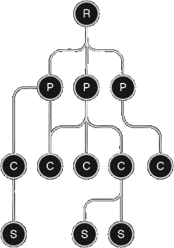
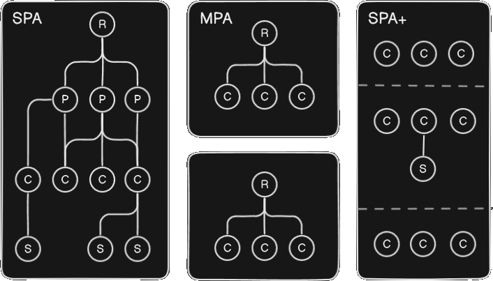

# paper proposals
<hr>

<div style='padding:0 25%'>
Scientific paper proposals related to frontend software engineering development. All proposal here are validated by PoCs
</div>

<br>

**Jonathan de Sena Ribeiro**


---

## SCHEDULE

<style scoped>
   table { margin: 0 10%; }
</style>

| | |
|-:|:-|
| **REACTIVE OBJECT** <br> design pattern | solve the exponential stateful complexity in frontend JSX componentization |
| **FUNCTION DECORATOR** <br> web specification | enable decorator for function, solving the hosting issue impediment |
| **HTML CONTAINER** <br> architectural style |  micro-component architecture style to prevent component over-engineering | 

---

# reactive objects
improved stateful management

---

## stateless component
### reactive objects

Stateless component is the simplest way to componentization.

```tsx
const Stateless = props => <h1>Hello, {props.name}!</h1>
```

---

## stateful component
### reactive objects

<aside cols='4:5'><div left  style='margin-top:-25px;'>

```tsx
import React, { useState } from 'react';

function LocalState() {
  const [name, setName] = useState('');
  
  return <p>
      <h1>Hello, {name || 'World'}!</h1>
      <input value={name} onChange={e => 
         setName(e.target.value)} />
   </p>
}
```

</div><div style='margin-top:-25px;'>

```tsx
import React, { useState } from 'react'
import { createContext, useContext } from 'react'

const MyContext = createContext()
function GlobalState() {
  const [name, setName] = useContext(MyContext)
  return <p>
      <h1>Hello, {name || 'World'}!</h1>
      <input value={name} onChange={e => 
         setName(e.target.value)} />
   </p>
}

export default function App() {
  const state = useState('')
  return <MyContext.Provider value={state}>
      <GlobalState />
   </MyContext.Provider>
}
```

</div></aside>

---

## self-render states
### reactive objects


<aside cols='4:5'><div left  style='margin-top:-25px;'>

```tsx
const LocalState = props =>  <p>
   <h1>Hello, {props.name || 'World'}!</h1>
   <input value={props.name} onChange={e => 
      props.name = e.target.value)} />
</p>
```

</div><div style='margin-top:-25px;'>

```tsx
const store = { name: 'world' }

await launch({ store }).server()  

const GlobalState = (props, { store }) =>  <p>
   <h1>Hello, {store.name || 'World'}!</h1>
   <input value={store.name} onChange={e => 
      store.name = e.target.value)} />
</p>
```

</div></aside>

---

## related papers 
### reactive objects

<style scoped>
   tr:last-of-type td { font-weight:200 }
</style>

| Approach    | Scientific Reference |
| -: | :- |
| MobX (2009+)         | Reactive Programming Model for UI Development (Erik Meijer) \[Microsoft Research]          |
| Recoil (2020)        | Recoil: Declarative Data-flow Graphs for React (Facebook)                                  |
| RxJS + React (2007+) | Towards a Reactive Programming Model for UI Development (Erik Meijer) + various FRP papers |
| Valtio (2019+)       | Reactive Programming with JavaScript Proxies        |

---

## differentials 
### reactive objects


<aside cols='2'><div left line>

- render interception (**mine**)

```tsx
const LocalState = props =>  <p>
   <h1>Hello, {props.name || 'World'}!</h1>
   <input value={props.name} onChange={e => 
      props.name = e.target.value)} />
</p>
```

<div style='zoom:0.9; color: silver'>
Render interception has same approach of server side rendering in meta-frameworks
</div>

</div><div>

- state snapshot (**valtio**)

```tsx
import { proxy, useSnapshot } from 'valtio';

const state = proxy({ name: 'World' });

function Counter() {
  const snap = useSnapshot(state)
  return <p>
      <h1>Hello, {snap.name}!</h1>
      <input value={snap.name} onChange={e => 
         state.name = e.target.value)} />
   </p>
}
```

---

# function decorators

Proof-of-Concept for functional decorator specification

---

## context & problem
### function decorators

<div style='margin:0px 15% 20px 15%'>
TC39 is a technical comittee that is specifying decorators, that has not support function decorator. 

Their allegations are:
</div>

<style scoped>
   ul { zoom: 0.95;  }
</style>

| | |
|:-|:-|
- Function declarations lack a container object to attach metadata to. 
- Decorating hoisted function (...) would require rethinking how function hoisting works
- Function declarations don’t provide a reflection target for metadata decoration                           
- Top-level function decorators is out of scope for the current decorators proposal                                           
- Function wrappers (HOFs) are a viable alternative for decorating functions 

---

## counter-arguments
### function decorators

How to deal with T39 opposite argument against function components

| | |
|:-|:-|
| Lack of container object  | Functions, as an object, could appends fn.decorators |
| It could break function hoisting | Deal it as function decorator constrains |
| Targetless function declaration | Target function and module reference (ImportMeta) |
| Function decorators low priority | React, the biggest js lib, uses functional components |
| High-order function is enough | any decorator is viable without a native syntax |


---

## design proposal
### function decorators

<aside cols='2'><div>

- class decorator (TC39)

```ts
function role(roleName: string) {
  return function (target, key) {
    Reflect.defineMetadata("role", 
      roleName, target, key)
  }
}

class UserService {
  @role("admin") deleteUser() { ... }
}

const role = Reflect.getMetadata("role", 
   UserService.prototype, "deleteUser")
```

</div><div>

- function decorator (this)

```ts
class role extends Decorator {
   constructor(private role) { super(role) }
   public metadata() { return this.role }
}

@role('admin') function Sample() { ... }

Sample.decorators.at(0) 
// { name:'role', data:'admin', args:'admin' }
```

</div></aside>

---

## related papers
### function decorators

there is zero research in function decorators in js.

---

# HTML container

Micro-component architecture

---

## monolith components
### html container

<aside cols='2'>

<div left>

**(R)**: root component
**(P)**: page component
**(C)**: component
**(S)**: sub-component

<hr/>

- costful rendering
- highly complex
- deep tree

</div>
</aside>

---

## page x components
### html container

**component concept overfits pages**


| |  |  |
|-:|-|-|
| parametrization | attributes | url |
| responsability | reusability | singularity |
| composition | children | iframe |


---

## micro-components
### html container

<aside cols='2'><div>
   

   **[ ]** page  &nbsp;&nbsp;  **( )** component  &nbsp;&nbsp; **[-]** page container

</div>
<div left style='padding:0 50px'>

**Advantages**
- component render
- server-side first
- containerized
- routable
- agnostic

</div>
</aside>

---

## demonstration
### html container


<aside cols style='grid-template-columns: 4fr 2fr'>

```html
<container route='/sample/:id' 
   src='http://etc.com/example.ts'>
   
   <h1>${ self.title }</h1>

   <Hello number=1 string='' object={}
      boolean=true array=[] refer=self.obj />

   <input oninput='self.title=event.target.value' />
</container>
```

- routing
- props binds
- data binding
- state handling
- reactive objects
- micro-components
- metatag transfers

</aside>

---

## related papers
### html container 

|  |  |
| -: | :- |
| **Componentization at multiple granularities** <br> (Meyers et al., 2016; Reenskaug et al., 2015) | Studies on UI scalability by fragmenting components into smaller, independent units. |
| **Reactive micro-components architecture** <br> (Pinto et al., 2019) | Models for reactive micro-components that manage local state and rendering .                                   |
| **Tree-shaking and granular lazy loading** <br> (Zakas, 2021; Croft, 2020) | Strategies to load only necessary subtrees and avoid rendering the entire tree. |
| **Concurrent rendering** <br> (Dan Abramov; Facebook Engineering, 2022) | Techniques for concurrent and independent rendering of React subtrees. |
| **Modular UI Composition Patterns** <br> (Mezzalira, 2019; Richards & Ford, 2020) | Patterns to compose multiple React trees in a decoupled way. |

---

## research gaps
### html container 

|  |  |
| -: | :- |
| **Componentization at multiple granularities** <br> (Meyers et al., 2016; Reenskaug et al., 2015) | Advantagens of component fragmentation, but with no techinical solution for it. |
| **Reactive micro-components architecture** <br> (Pinto et al., 2019) | Micro-component as local states, with no solution for global/shared states |
| **Tree-shaking and granular lazy loading** <br> (Zakas, 2021; Croft, 2020) | Reducing uncessary rendering of entire tree, but yet dealing with monolith component tree |
| **Concurrent rendering** <br> (Dan Abramov; Facebook Engineering, 2022) | Allows concurrent rendering, but inside of a monolith component tree. |
| **Modular UI Composition Patterns** <br> (Mezzalira, 2019; Richards & Ford, 2020) | Subtree inside of a root tree for separation of concern, but could impact performance |

---

## advantages
### html container

high performance
low abstraction
tech agnostic
easy to use
innovative

---

# E N D
## thanks
### questions?


<style>
   @import url('https://fonts.cdnfonts.com/css/agave');
   @import url('https://fonts.googleapis.com/css2?family=Fira+Sans:wght@100;200;300;400&display=swap');
   @import url('https://fonts.googleapis.com/css2?family=Fira+Sans:wght@100;200;300;400&family=Quicksand:wght@300;400;500;600;700&display=swap');
   @import url('https://fonts.googleapis.com/css2?family=Geist:wght@100..900&display=swap');

   section { font-size: 1.8rem; letter-spacing:0.3px }
   code * { font-family: agave, consolas, monospace }
   body, ul, section { font-family: 'geist'; font-weight:100 }
   h1, h2, h3, h4, h5 { font-family: 'geist' }
   strong { white-space: nowrap }
   [cols] { display:grid; }
   [cols='2'] { grid-template-columns: 1fr 1fr; }
   [cols='4:5'] { grid-template-columns: 4fr 5fr; }
   pre > * { border: solid 7px #333; border-radius: 5px;  }   
   pre { filter: contrast(1.17); font-size: 1.9rem;  }   
   [left] { text-align:left }
   table td { font-size: 1.6rem }   
   h1 { color: wheat; text-transform: uppercase }
   h3 {
      padding:0;
      margin: 0;
      margin-top:-40px;
      font-weight:100;
      letter-spacing: 7px;
      margin-left: 2%;
      font-size: 2rem;
      margin-bottom: 40px;
   }

   [line] {
      border-right: dashed 5px dimgrey;
      margin-right: 30px;
      padding-right: 30px;
   }
</style>
